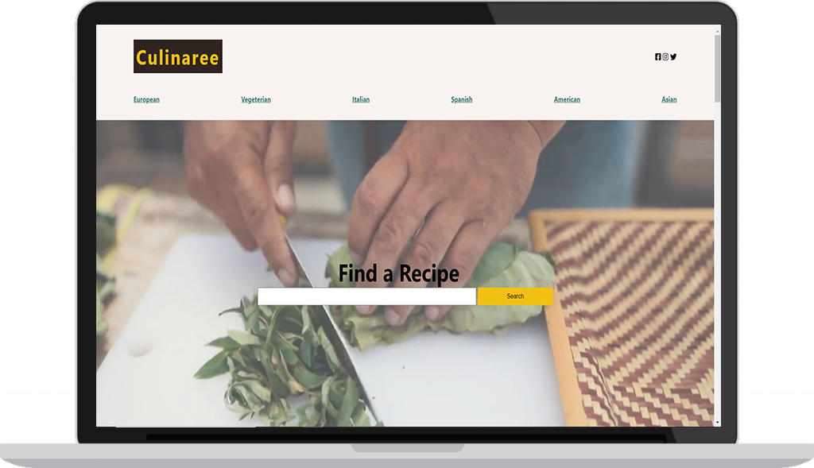
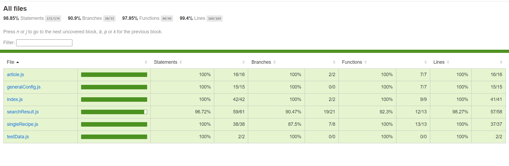

# Culinaree



Culinaree is a recipe website that allows the user to find different recipes based on search input.
It is connected to the spoonacular API.
Follow this link to see it live.
Please keep in mind that Spoonacular restricts the number of requests for free users.
Do not submit too many requests to allow other users to see how it performs.

# Prerequisites :

To clone and run this application, you'll need [Git](https://git-scm.com) and [Node.js](https://nodejs.org/en/download/) (which comes with [npm](http://npmjs.com)) installed on your computer.

# Technology used :

- Vanilla Javascript (es6)
- Sass/Scss
- Axios
- Webpack
- Babel
- Jest
- JSDOM
- Nock
- @testing-library/dom

# Features

- Asynchronous Javascript
- LocalStorage
- SessionStorage
- Api interaction
- Setting up a test environment
- Setting up Webpack from scratch
- Integration tests

# How to use

```bash
# Clone this repository
$ git clone https://github.com/idriss30/Culinaree-v2.git
# Go into the repository
$ cd culinaree-v2
# Install dependencies
$ npm install
# create environment variables
$ create a .env file
# add your spoonacular api key(s) in .env file
# open generalConfig.js and edit function generateKey based on your spoonacular key(s) name.

# Run the app
$ npm run start

# Run the test
$ npm run test

```

# Test Coverage



# Author

Created by me Idris.</br>
You can find me on <a href="https://www.linkedin.com/in/idrissciss/" target="_blank" rel="noreferrer">LinkedIn</a>

# Support

If you learn anything from this project and/or would like to support:</br>
Please give a star, I would appreciate.</br>
Thanks for your time.
